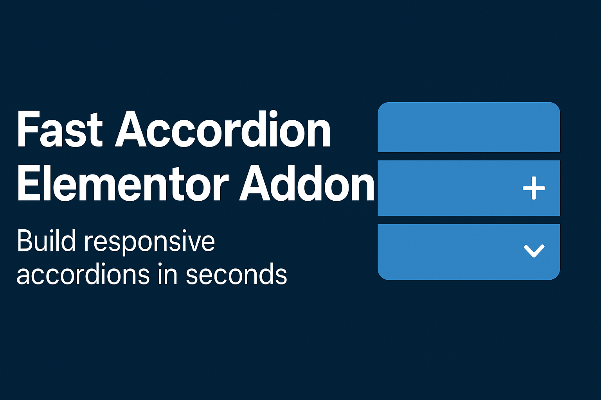

# Fast-Accordion-Elementor-Addon

Fast Accordion Elementor Addon is a custom Elementor widget that allows you to create stylish and functional accordion tabs with a blocked layout, including support for dynamic templates. Perfect for FAQs, feature lists, and organized content presentation.

## Version

1.0.5

## Features

- **Block Layout:** Unique blocked design for accordion items.
- **Customizable Styles:**
  - **Colors:** Easily change background and text colors for both default and active states.
  - **Typography:** Full control over font family, size, weight, and more.
  - **Spacing:** Adjust padding and margins to fit your design.
- **Responsive:** fully responsive and looks great on all devices.
- **Easy to Use:** Integrated seamlessly into the Elementor interface.
- **Multiple Content Sources:** Use static content, Elementor Templates, or any WordPress Page.

## Installation

1. Upload the `fast-accordion-elementor-addon` folder to the `/wp-content/plugins/` directory.
2. Activate the plugin through the 'Plugins' menu in WordPress.
3. Make sure you have **Elementor** installed and activated.

## Usage

1. Open a page or post with Elementor.
2. Search for the **Fast Accordion** widget in the elements panel.
3. Drag and drop the widget into your layout.
4. Add items (Title and Content) in the **Content** tab.
5. Customize the look and feel in the **Style** tab.

## Requirements

- WordPress 5.0 or higher
- Elementor 3.0 or higher
- PHP 7.4 or higher

## Changelog

### 1.0.5
- **New:** Added "Page" content source to include any WordPress Page in accordion tabs.
- **Improvement:** Separated "Templates" and "Pages" into distinct selection controls.

### 1.0.4
- **Fix:** Fixed External layout styling to ensure items are responsive.
- **New:** Implemented Flexbox layout for External items to fill available space (grow to fit).
- **Update:** Standardized grid/flex gaps and margins.

### 1.0.2
- Initial Release features.
